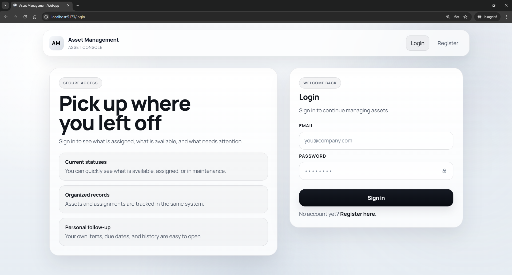
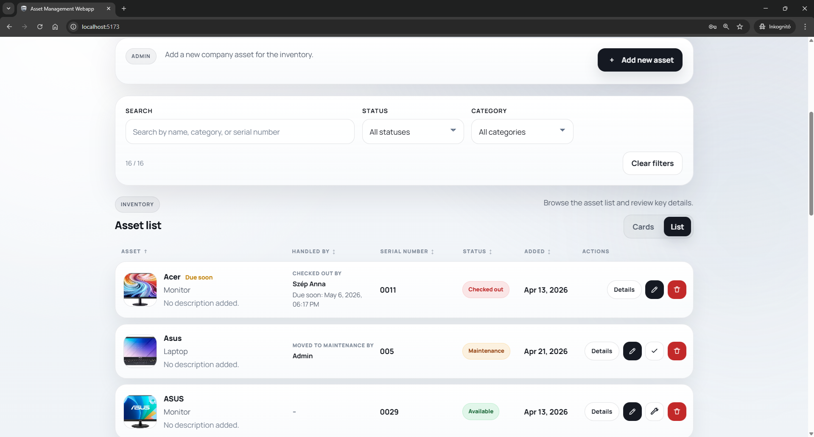
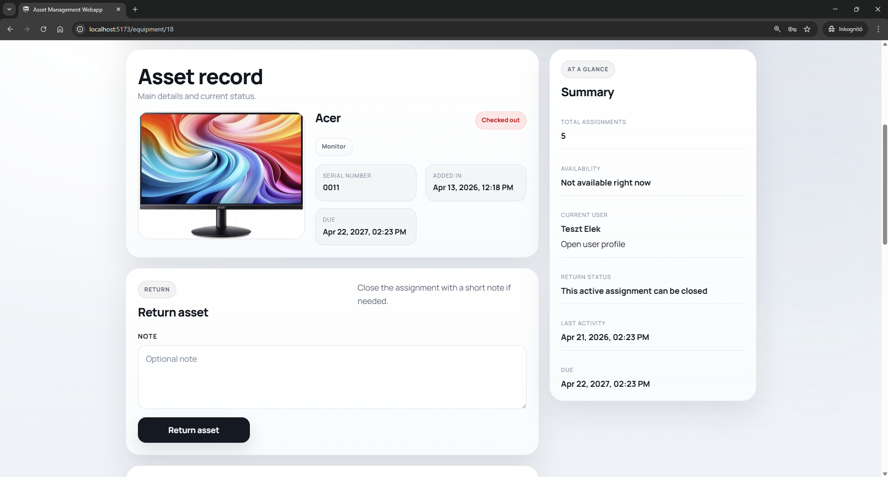
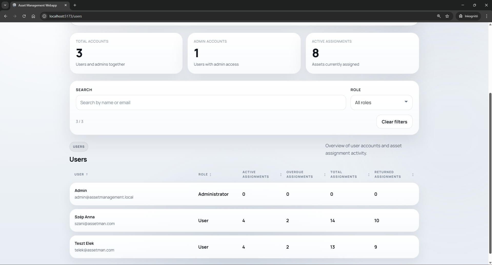
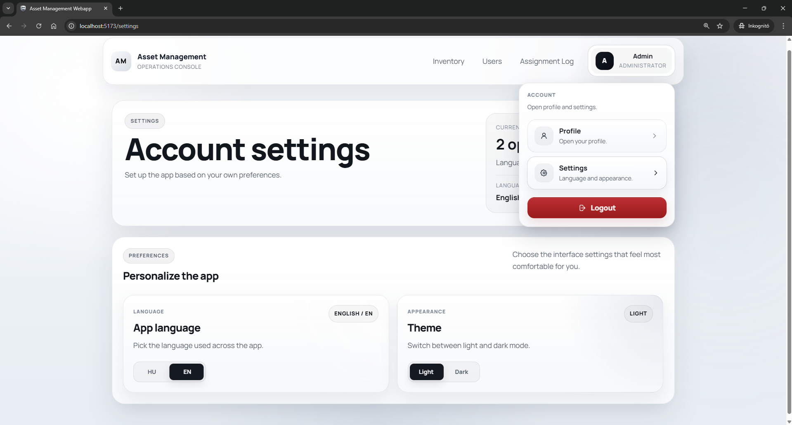

# Asset Management Web App

A full-stack web app for managing company equipment, from availability and assignments to maintenance records. Built with React, ASP.NET Core, and PostgreSQL.

## Project overview

This project is a portfolio demo for a small internal asset management system. The goal is to show a realistic full-stack workflow with authentication, role-based access, equipment management, and asset assignment history.

Current core capabilities:

**Inventory and assignment tracking**

- inventory overview for company equipment
- asset details with assignment actions and history
- user-facing `My Items` flow for assigned and returned assets
- protected equipment image uploads
- shareable list filters, warning filters, and sortable table headers

**Admin workflow**

- admin pages for users, user details, and asset assignment activity
- admin-only equipment creation, editing, deletion, and maintenance actions
- admin assignment flow that assigns assets to regular users
- admin user management for profile data, roles, and account removal

**Account and demo setup**

- user login with JWT-based authentication
- password change flow for signed-in users
- profile and settings pages for signed-in users
- light and dark appearance settings with persisted preference
- Docker-based local development and production-like demo workflows

The app is designed as a focused internal equipment and assignment tracker, not as a large enterprise asset platform.

Main concepts in the current UI:

- `Inventory`: all company equipment
- `My Items`: the signed-in user's assigned and returned assets
- `Users`: admin view of regular users and their assigned assets
- `Assignment Log`: admin history of active and returned asset assignments

## Demo

A 6-minute demo video is available here: [Watch the demo](https://youtu.be/dxP30sKYmxA).

The screenshots below show the main app screens and admin-facing flows.

### Login



### Inventory



### Asset Details



### User Management



### Account Settings



## Quick start

Create a root `.env` file from the example, then start the local development stack:

```powershell
Copy-Item .env.example .env
docker compose up --build
```

Then try the app in your browser at `http://localhost:5173`.

The example `.env` enables a local bootstrap admin so the demo is usable right away:

- email: `admin@assetmanagement.local`
- password: `Admin123!`

Use this admin account to add the first assets. Public registration creates regular user accounts only.

## Tech stack

- frontend: React, TypeScript, Vite
- backend: ASP.NET Core 8, Entity Framework Core
- database: PostgreSQL
- containers: Docker Compose
- production-like frontend hosting: Nginx

## Backend API

The backend provides a JSON API under `/api` and uses JWT Bearer authentication for protected routes.

Most responses use DTOs, so the API does not return EF Core entities directly. Equipment image uploads use `multipart/form-data`. Most other endpoints use JSON request bodies.

In this project, a `checkout` means an asset assignment record. It stores which user has an asset, when it was assigned, the due date, and when it was returned.

### Authentication

| Method | Endpoint | Access | Purpose |
| --- | --- | --- | --- |
| `POST` | `/api/auth/register` | Public when enabled | Register a regular user |
| `POST` | `/api/auth/login` | Public | Sign in and receive a JWT |
| `POST` | `/api/auth/change-password` | Signed-in users | Change the current user's password |

Registration is controlled by environment settings. Local development can allow public sign-up, while the production-like demo can work as a private internal app.

### Equipment

| Method | Endpoint | Access | Purpose |
| --- | --- | --- | --- |
| `GET` | `/api/equipment` | Signed-in users | List inventory items |
| `GET` | `/api/equipment/{id}` | Signed-in users | Get asset details |
| `POST` | `/api/equipment` | Admin | Create an asset, optionally with an uploaded image |
| `PUT` | `/api/equipment/{id}` | Admin | Update asset metadata and image |
| `DELETE` | `/api/equipment/{id}` | Admin | Delete an asset if it is not assigned |
| `POST` | `/api/equipment/{id}/checkout` | Signed-in users | Create an asset assignment |
| `POST` | `/api/equipment/{id}/return` | Assigned user or admin | Return an assigned asset and close the assignment |
| `POST` | `/api/equipment/{id}/mark-maintenance` | Admin | Mark an available asset as under maintenance |
| `POST` | `/api/equipment/{id}/mark-available` | Admin | Move a maintenance asset back to available |
| `GET` | `/uploads/equipment/{fileName}` | Signed-in users | Load a protected equipment image |

Uploaded equipment images are checked by size, extension, content type, and file signature before they are stored.

### Asset assignments

| Method | Endpoint | Access | Purpose |
| --- | --- | --- | --- |
| `GET` | `/api/checkout` | Admin | List all asset assignment records |
| `GET` | `/api/checkout/{id}` | Admin | Get one asset assignment record |
| `GET` | `/api/checkout/user/{userId}` | Admin | List a user's asset assignment history |
| `GET` | `/api/checkout/my` | Signed-in users | List the current user's asset assignment history |

### Users

| Method | Endpoint | Access | Purpose |
| --- | --- | --- | --- |
| `GET` | `/api/users` | Admin | List users |
| `GET` | `/api/users/{id}` | Admin | Get one user |
| `PUT` | `/api/users/{id}` | Admin | Update name, email, and role |
| `DELETE` | `/api/users/{id}` | Admin | Delete a user and clean up related asset assignments |

The API prevents deleting the last admin account. It also blocks admins from removing their own admin role from the user-management page.

### API design notes

- authentication uses short-lived JWTs
- role checks happen in the API, not only in the frontend
- admin role changes are checked against the current database state
- image files are served through an authenticated API route instead of public static files
- EF Core migrations run automatically on startup for the local/demo workflow
- Swagger is available in development mode

## Repository structure

- [compose.yaml](./compose.yaml): local development Docker stack
- [compose.prod.yaml](./compose.prod.yaml): production-like Docker override
- [frontend/Dockerfile](./frontend/Dockerfile): frontend dev container
- [frontend/Dockerfile.prod](./frontend/Dockerfile.prod): production-like frontend build and serve container
- [frontend/nginx.conf](./frontend/nginx.conf): frontend reverse proxy config for the production-like path
- [api/AssetManagement/AssetManagement.Api/Dockerfile](./api/AssetManagement/AssetManagement.Api/Dockerfile): API container build
- [.env.example](./.env.example): example root environment file for Docker Compose

## Docker workflows

The repository currently supports two container workflows.

### 1. Local development stack

The default [compose.yaml](./compose.yaml) is the local development setup:

- frontend runs with the Vite dev server
- API is published directly to a host port
- PostgreSQL is published directly to a host port
- public registration can stay enabled
- login rate limiting is off by default

Start it from the repository root:

```powershell
docker compose up --build
```

Run in the background:

```powershell
docker compose up --build -d
```

Default local endpoints:

- frontend: `http://localhost:5173`
- API: `http://localhost:5071`
- PostgreSQL from host tools: `localhost:5433`

### 2. Production-like stack

The production-like path uses [compose.yaml](./compose.yaml) together with [compose.prod.yaml](./compose.prod.yaml).

In this mode:

- frontend is built and served from Nginx
- frontend and API work through the same origin
- `/api` is proxied to the ASP.NET API
- `/uploads` is proxied to the protected equipment image endpoint
- API and PostgreSQL are no longer published to host ports
- public registration is disabled by default
- login rate limiting is enabled by default
- forwarded headers are enabled for the reverse proxy

Start it from the repository root:

```powershell
docker compose -f compose.yaml -f compose.prod.yaml up --build
```

Run in the background:

```powershell
docker compose -f compose.yaml -f compose.prod.yaml up --build -d
```

Default production-like endpoint:

- app entry point: `http://localhost:8080`

In the production-like setup, the browser uses:

- frontend: `http://localhost:8080`
- API through the same app origin: `http://localhost:8080/api`
- protected image requests through the same app origin: `http://localhost:8080/uploads/...`

## Local environment setup

Create a root `.env` file based on [`.env.example`](./.env.example).

The root `.env` is used by Docker Compose for local values:

- host ports
- PostgreSQL credentials
- frontend runtime settings
- JWT settings
- registration flags
- login rate limit settings
- bootstrap admin values
- CORS origins

The root `.env` is ignored by Git and should stay local.

### Important local variables

Local development examples in [`.env.example`](./.env.example):

- `JWT_KEY`
- `REGISTRATION_ENABLED`
- `VITE_REGISTRATION_ENABLED`
- `AUTH_RATE_LIMIT_ENABLED`
- `BOOTSTRAP_ADMIN_ENABLED`

Production-like override examples are configured through `compose.prod.yaml` defaults such as:

- `REGISTRATION_ENABLED_PROD=false`
- `VITE_REGISTRATION_ENABLED_PROD=false`
- `AUTH_RATE_LIMIT_ENABLED_PROD=true`

## Authentication and access behavior

The app currently uses JWT Bearer authentication stored in browser `localStorage`.

Current behavior:

- expired or invalid JWT responses (`401`) clear the local session and redirect the user back to login
- forbidden responses (`403`) redirect the user to the app root and show a permission error message
- unknown routes redirect unauthenticated visitors back into the login flow
- unknown routes show a dedicated not-found page only for authenticated users
- visiting `/login` or `/register` while already logged in triggers an automatic logout

Current signed-in navigation:

- all signed-in users can access `Inventory`, `My Items`, `Profile`, and `Settings`
- admins can also access `Users` and `Assignment Log`
- the profile menu contains `Profile`, `Settings`, and `Logout`
- signed-in users can change their own password from the profile area

### Registration behavior

Registration is environment-controlled.

Local development:

- registration can stay enabled
- login and register links are visible in the guest navigation

Production-like mode:

- registration is disabled by default
- the register page is not available
- guest navigation hides both login and register links for a cleaner private demo flow

## App flows

### User flow

Regular users mainly work in these views:

- `Inventory`: browse company equipment and open asset details
- `My Items`: see assigned assets, due dates, and returned assets
- `Profile`: review signed-in account details
- `Settings`: change language and appearance preferences

Regular users can:

- view equipment
- check out available equipment for themselves
- return their own assigned assets
- review their own assignment history
- change their own password

### Admin flow

Admins have everything regular users have, plus:

- `Users`: list regular users and open user detail pages
- `User details`: see a selected user's assigned assets and returned assets
- user profile editing for display name, email, and role
- user deletion with related asset assignment cleanup
- `Assignment Log`: review active and returned asset assignments
- inventory create/edit/delete and maintenance actions
- asset assignment to regular users

Admins do not assign assets to themselves through the admin assignment flow. Instead, they assign available assets to regular users.

Admin role changes are checked against the current database state. This means removed admin access takes effect without waiting for the old JWT to expire.

## Main pages

- `/`: inventory
- `/equipment/:id`: asset details
- `/my-items`: signed-in user's assigned assets and history
- `/users`: admin user list
- `/users/:userId`: admin user detail view
- `/all-checkouts`: admin assignment log
- `/profile`: signed-in user profile
- `/settings`: signed-in user settings
- `/change-password`: signed-in user password change

Legacy redirects still exist for:

- `/my-checkouts` -> `/my-items`
- `/users/:userId/checkouts` -> `/users/:userId`

## Image uploads

Equipment images are no longer served as public static files.

Current behavior:

- uploaded files are stored in a Docker volume
- image URLs are resolved through authenticated API access
- protected image loading uses the logged-in user token
- unauthorized image requests follow the same session-expired flow as the rest of the app

## List state and sorting

The main list pages keep search, filters, warning filters, view mode, and table sorting in query parameters.

This currently applies to:

- inventory
- assignment log
- users
- my items
- user details

Examples:

- `/all-checkouts?state=active&warning=overdue&view=list`
- `/users?search=anna&role=User&sort=name&dir=asc`
- `/my-items?current-view=cards&current-warning=dueSoon`

In list view, sorting is handled from the table headers instead of a separate sort dropdown. Columns with actions are not sortable.

## Persistence

The Docker setup uses named volumes for:

- PostgreSQL data
- uploaded equipment images
- ASP.NET Data Protection keys

This means the following survive container recreation:

- database records
- uploaded files
- ASP.NET protection keys

<!--
## Daily Docker commands

Show running services:

```powershell
docker compose ps
```

See logs:

```powershell
docker compose logs -f
```

Stop and remove containers:

```powershell
docker compose down
```

Stop containers and remove named volumes too:

```powershell
docker compose down -v
```
-->

## Development notes

- the backend applies EF Core migrations automatically on startup
- a local bootstrap admin can be enabled from the root `.env` for development only
- the frontend forms use explicit `autocomplete` values for better browser and password manager behavior
- the default UI language fallback is English
- language and appearance preferences are stored locally in the browser
- the production-like stack is meant as a realistic demo path, not as a final production deployment
- automated tests and CI are planned next steps

## Current limitations

The project is in a strong demo-ready state, but a few production-level decisions are still intentionally simple.

| Current limitation | Better production direction |
| --- | --- |
| JWT is stored in browser `localStorage`. | Use secure `HttpOnly` cookies instead, so JavaScript cannot read the token. |
| The API has role checks, but it does not have a detailed permission system. | Add clear authorization policies if the app needs more roles or team rules. |
| Forwarded headers can trust all proxies in the Docker demo setup. | In production, allow only the real reverse proxy or load balancer. |
| Login rate limiting is IP-based. | Also check the account email and add better lockout rules. |
| EF Core migrations run automatically on startup. | Run migrations as a separate deployment step, with backup planning. |
| Uploaded files are stored on a Docker volume. | Store uploads in object storage and add virus scanning and backups. |
| Secrets are configured through local environment variables. | Use a secret manager or GitHub Actions secrets for deployed environments. |
| The production-like Docker setup does not include HTTPS or a real domain. | Add HTTPS, domain routing, and certificate renewal in the hosting setup. |
| There are no automated tests yet. | Add backend unit/integration tests, frontend tests, and a GitHub Actions pipeline. |
| There is no monitoring setup yet. | Add structured logs, health checks, metrics, and error tracking. |

## License

This repository is shared as a public portfolio project.

It is public for review, but it is not released as open-source software.
See [LICENSE](./LICENSE) for details.
